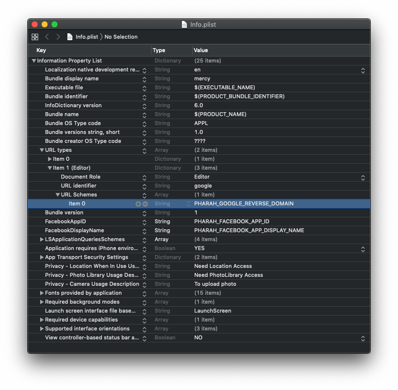

# Setup Firebase

## Create project

Go to firebase console: https://console.firebase.google.com/ and click on **Add Project**

> e.g. `goboost-dev` where goboost if your project name, reason of have `-dev` suffix is for [multi env setup](multiple-env.md) later on.

Replace `PHARAH_FIREBASE_PROJECT` in `.firebaserc` with the **Project ID** from that new project.

```json
{
  "projects": {
    "dev": "PHARAH_FIREBASE_PROJECT",
    "staging": "PHARAH_FIREBASE_PROJECT",
    "prod": "PHARAH_FIREBASE_PROJECT"
  }
}
```

For starter, you only need to replace the `dev` one.

## Create iOS app

Go to your firebase project's Dashboard, can click on **Add App**, add an **iOS app**.

In iOS bundle ID, put in `com.goboost` with `goboost` replaced with your own project name.

All the setup has already been done for you, click skip on the last step.

Place downloaded `GoogleService-Info.plist` under `scripts/configs/dev/`

Open `scripts/configs/dev/GoogleService-Info.plist` and copy the value of key `REVERSED_CLIENT_ID`

Open `scripts/configs/dev/Info.plist`, replace `PHARAH_GOOGLE_REVERSE_DOMAIN` with the value your just copied



!> Never edit the Info.plist in Xcode project directly, that’s just a temporary file.

## Create android app

Go to your firebase project's Dashboard, can click on **Add App**, add an **android app**.

In Android package name, put in `com.goboost` with `goboost` replaced with your own project name.

Place the `google-service.json` under `scripts/configs/dev/`

## Create admin service account

Go to firebase project settings, under **Service Account**

Generate new private key for Node.js, download and rename it to `adminsdk.json`.

Place it in `scripts/configs/dev/`

!> Remember to NEVER push this file to a public repo

## Enable firebase services

On firebase console, go to **Authentication**

- Enable Email / Password
- Enable Phone

Go to **Database**

- Enable firestore database in lock mode
- Enable Realtime database in lock mode

Go to **Storage**, **Hosting** and **Functions**

- Click Get Started with default options

## Optional: Upgrade to pay as you go plan

With default free tier, you might run into some issues with when billing not enabled.
It won't really cost anything, (unless you leaked your `adminsdk.json`).

> After all these, it's a good time to do another commit
